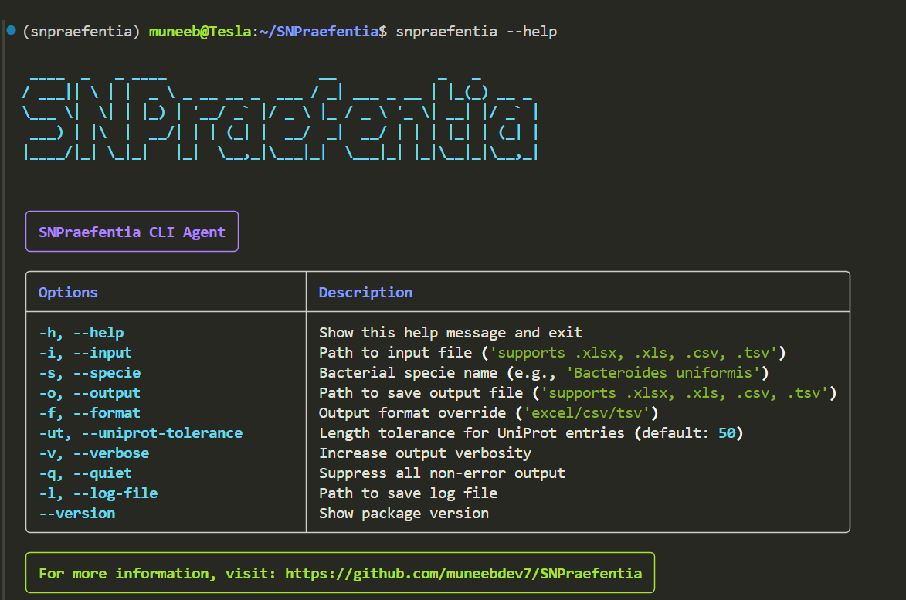

# SNPraefentia: SNP Prioritization from Metagenomic Variants

[](https://anaconda.org/)
[](https://pypi.org/)
[](https://www.python.org/downloads/)

[](https://doi.org/10.5281/zenodo.17716022)

[](https://opensource.org/licenses/Apache-2.0)

SNPraefentia is a comprehensive tool for prioritizing Single Nucleotide Polymorphisms (SNPs) in metagenomic variants. It helps in identifying 
potentially significant variants by analyzing sequencing depth, amino acid changes, and protein domain information.

## Installation

### Setting up the conda environment

First, create a new conda environment with Python 3.11:

```bash
# Create a new conda environment
conda create -y -n snpraefentia python=3.11

# Activate the environment
conda activate snpraefentia
```

### Installing SNPraefentia

With the conda environment activated, install SNPraefentia using pip:

```bash
# Install from PyPI
pip install snpraefentia
```

Or you can install from source:

```bash
# Clone the repository
git clone https://github.com/muneebdev7/SNPraefentia.git
cd SNPraefentia

# Install package
pip install .

# Install in development mode (if you want to modify the code)
pip install -e .
```

### Dependencies

SNPraefentia requires the following Python packages (see [`requirements.txt`](requirements.txt)):

- pandas (≥1.0.0)
- numpy (≥1.18.0)
- requests (≥2.22.0)
- ete3 (≥3.1.1)
- openpyxl (≥3.1.5)
- matplotlib (≥3.0.0)
- seaborn (≥0.10.0)
- adjustText (≥0.7.3)
- rich (>=13.0.0)

These dependencies will be installed automatically when using pip.

## First-time Setup

### NCBI Taxonomy Database

On first use, SNPraefentia needs to download the NCBI taxonomy database. This is a one-time process that requires approximately 600+ MB of disk space:

```bash
# This happens automatically on first use, but might take a few minutes
# You can also trigger it manually before running SNPraefentia:
python -c "from ete3 import NCBITaxa; ncbi = NCBITaxa()"
```

The database will be stored in `~/.etetoolkit/` by default.

### Verifying Installation

To verify that the package is installed correctly:

```bash
snpraefentia --version
```

This should display the current version (2.0.0).

## Usage


### Command Line Interface

#### Basic Usage

```bash
# For CSV input/output
snpraefentia --input your_data.csv --specie "Bacteroides uniformis" --output results.csv

# For Excel input/output
snpraefentia --input your_data.xlsx --specie "Bacteroides uniformis" --output results.xlsx
```

#### Required Arguments

- `--input`, `-i`: Path to input file containing SNP data (CSV or Excel: `.csv`, `.xlsx`)
- `--specie`, `-s`: Bacterial species name (e.g., 'Bacteroides uniformis')
- `--output`, `-o`: Path to save output file (CSV or Excel: `.csv`, `.xlsx`)

#### Optional Arguments

- `--format`, `-f`: Output format override (determined from output file extension)
- `--uniprot-tolerance`, `-ut`: Length tolerance when matching UniProt entries (default: 50)

#### Logging Options

- `--verbose`, `-v`: Increase output verbosity (shows DEBUG messages)
- `--quiet`, `-q`: Suppress all non-error output
- `--log-file`, `-l`: Path to save log file

#### Help and Version

- `--help`, `-h`: Show help message and exit
- `--version`: Show version and exit

A glimpse of the command line interface:


### Python API

You can also use SNPraefentia programmatically in your Python scripts:

```python
from snpraefentia.core import SNPAnalyst

# Initialize with default settings
analyst = SNPAnalyst()

# Process an input file
results = analyst.run(
    input_file="path/to/input.csv",
    specie="Bacteroides uniformis",
    output_file="path/to/output.csv"  # Optional, omit to skip saving
)

# Or process an existing DataFrame
import pandas as pd
df = pd.read_csv("my_snps.csv")
processed_df = analyst.process_dataframe(df, "Bacteroides uniformis")

# Save results manually if needed
processed_df.to_csv("custom_output.csv", index=False)
```

## Input Format


SNPraefentia accepts both CSV (`.csv`) and Excel (`.xlsx`) files as input. The file should contain the following columns:

| Column | Description | Example |
|--------|-------------|---------|
| `Evidence` | Read depth information | `A:10 C:5` |
| `Effect` | Variant effect prediction | `p.Ala123Gly` |
| `Gene` | Gene name | `geneA` |
| `Amino_Acid_Position` | Amino acid position information | `123/500` |

Additional columns are allowed and will be preserved in the output.

## Output Format


SNPraefentia outputs results in the same format as specified by the output file extension (`.csv` or `.xlsx`). The following columns are added to the input data:

| Column | Description |
|--------|-------------|
| `Gene` | Gene name |
| `UniProt_ID` | UniProt identifier if found |
| `Total_Protein_Length` | Total length of the protein |
| `Bacterial_Specie` | Species name |
| `Taxonomic_ID` | NCBI taxonomy ID |
| `Normalized_Depth` | Depth normalized to range [0,1] |
| `Amino_Acid_Impact_Score` | Score based on physicochemical property changes |
| `Domain_Position_Match` | Whether mutation is in a protein domain (1=yes, 0=no) |
| `Final_Priority_Score` | Priority score as percentage (0-100%) |

## Configuration

### UniProt Parameters

- `uniprot_tolerance`: When matching genes to UniProt entries, this parameter controls how close the protein length must be to the expected length (default: 50 amino acids)

### Logging Options

SNPraefentia provides three verbosity levels:

- **Normal** (default): Shows INFO level messages (major processing steps)
- **Verbose** (`--verbose`): Shows DEBUG level messages (detailed information)
- **Quiet** (`--quiet`): Shows only ERROR level messages (problems only)

You can also save logs to a file with `--log-file path/to/logfile.log`.

## Examples

### Detailed Logging

```bash
snpraefentia --input snps.csv --specie "Klebsiella pneumoniae" --output results.csv --verbose --log-file snpraefentia_run.log
```

## Running Tests

This package uses Python's built-in unittest framework for testing all functions in the package.

To run all tests:

```bash
python -m unittest discover -s snpraefentia/tests -v
```

## Troubleshooting

### Common Issues

#### Missing NCBI Taxonomy Database

```bash
Error: NCBITaxa not initialized
```

Solution: Run the following command to download the database:

```bash
python -c "from ete3 import NCBITaxa; ncbi = NCBITaxa()"
```

#### Species Not Found

```bash
Warning: No taxonomy ID found for [species]
```

Solution: Check the spelling of your species name. Use the scientific name (genus and species).

## License

SNPraefentia is licensed under the Apache License 2.0 - see the [LICENSE](LICENSE) file for details.

### Patent Notice

The SNP scoring algorithms and methodologies implemented in this software are protected by patent rights owned by the SNPraefentia Authors. While the source code is available under the Apache License 2.0, usage of the scoring algorithms may require a separate patent license, particularly for commercial applications.

For patent licensing inquiries, please contact the authors.

See the [NOTICE](NOTICE) file for additional details regarding copyright and patent notices.

## Credits

SNPrafentia was developed by [Nadeem Khan](https://github.com/nadeemsines) and [Muhammad Muneeb Nasir](https://github.com/muneebdev7/metabolt) at [Metagenomics Discovery Lab (MDL)](https://sines.nust.edu.pk/) at SINES, NUST.

We thank the following professionals for their extensive assistance in the development of this package:

- [Dr. Masood Ur Rehman Kayani](https://sines.nust.edu.pk/faculty/masood-ur-rehman-kayani/)

## Citation

If you use SNPraefentia in your research, please cite our published paper:

**Paper Citation:**
```
Khan, N., Nasir, M. M., Mushtaq, A., & Kayani, M. U. R. (2025). SNPraefentia: A toolkit to prioritize microbial genome variants linked to health and disease. Bioinformatics Advances, vbaf297. https://doi.org/10.1093/bioadv/vbaf297
```

For questions, feature requests, or bug reports, please [open an issue on GitHub](https://github.com/muneebdev7/SNPraefentia/issues).
